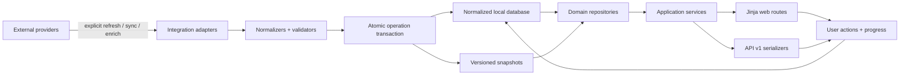

# Legacy audit and target architecture

Status: approved as M0 foundation on 2026-07-14.
Audit date: 2026-07-13.
Legacy source: `C:\Users\walid\Desktop\FlaskDashboard` (read-only).

## Executive summary

The legacy project contains substantial, useful product behavior and personal
data, but it is not a safe base for incremental redesign. Its entry point is a
roughly 34,500-line `app.py` with 163 route declarations, global runtime state,
integration code, persistence, normalization, and view assembly in the same
module. It also contains a partial extraction into domain services, 17 existing
`/api/v1` routes, 45 Jinja templates, three large global CSS files, and 51 test
files. The new system should preserve verified behavior and data meaning while
reimplementing the application around explicit domain boundaries.

The strongest reusable ideas are local snapshots, explicit refresh/sync,
freshness reporting, safe fallbacks, playback progress, reading extraction as a
targeted action, metadata repair previews, and the existing API pagination
shape. The old templates, CSS, JavaScript UI, route layout, and runtime globals
are not reusable.

## Stack and repository inventory

| Area | Legacy state | DragonV2 decision |
|---|---|---|
| Web | Flask 3, Jinja, Werkzeug | Flask application factory and Blueprints |
| Persistence | JSON snapshots, two SQLite files, CSV reports | SQLite as normalized source of truth; JSON snapshots as import/cache/export artifacts |
| Integrations | Requests, Notion, TMDB, YouTube OAuth/API, Google Books, Open Library, RSS, GitHub snapshots, Gemini, Stockfish, WebTorrent | Adapter interfaces with timeouts, typed results, and explicit sync commands |
| Frontend | Server-rendered templates, global CSS, inline and page-coupled behavior | Server-rendered Jinja, reusable macros, modular CSS, page-specific vanilla JS |
| Auth | Session flag, plaintext environment credential comparison | Hashed local admin credential, Flask-Login session, CSRF on all mutations |
| Tests | `unittest`/pytest-compatible tests, strong snapshot and fallback coverage | pytest layers plus browser smoke, responsive, and accessibility checks |
| Deployment | Gunicorn, Procfile, PythonAnywhere/Render notes | Environment-driven WSGI deployment; local development remains first-class |
| Optional media runtime | WebTorrent and a very large experimental magnet/playback tree | Isolated feature package behind a disabled-by-default flag |

Current size indicators:

- `app.py`: approximately 1.5 MB and 34.5k physical lines.
- Domain Python: Reading 17 files, YouTube 7, Chess 10, shared refresh/snapshot 7,
  API 2, and magnets/playback 328 files.
- Templates: 45 files; several individual pages exceed 1,000 lines.
- CSS: `style.css` 2,601 lines, `modern.css` 714 lines, `cinema.css` 343 lines.
- Tests: 51 files and approximately 16k lines.
- Routes: 163 legacy app routes plus 17 versioned API routes.

## Feature inventory and behavior to preserve

### Today and history

- Existing home aggregates movie counts and top films; replace the statistics-led
  page with actionable local projections.
- Preserve deleted YouTube history independently of the external playlist.
- Preserve cross-domain progress: movie playback, book status, article state,
  and chess training.

### Movies and TV

- Search, category/status/source/score filters, sorting, and pagination.
- Want to watch, watching, finished/watched states and personal score.
- Continue-watching projection from local progress.
- Directors, genres, TMDB matching/enrichment, correction previews, and Notion
  synchronization reports.
- Exported Notion/movie records and correction history are evidence for importer
  validation, not target runtime structure.
- Playback source selection and magnet handling must remain separate and optional.

### YouTube and PocketTube

- Separate Watch Later from PocketTube grouped subscriptions.
- Render cached/local snapshots only during normal GET requests.
- Group/channel normalization, related-video selection, shuffle modes, duration
  cache, stale/missing snapshot states, explicit refresh/sync, and safe failure.
- Removing a Watch Later item first records a local history entry, then performs
  the remote mutation, then updates local caches.
- Keep existing local snapshot usable when a remote sync fails.

### Reading

- RSS source registry with active/inactive state, fallbacks, diagnostics, source
  health, and freshness metadata.
- Article normalization, local snapshots, read/saved/starred state, retention,
  recipe/article of the day, backups, import/export, and audio cache metadata.
- Full-text extraction is explicitly requested and cached. Status GET requests
  must remain read-only and must not trigger extraction or network traffic.
- Snapshot pulls merge local source configuration and reject malformed or
  suspiciously tiny remote payloads.

### Books and quotes

- 142 current book snapshot records and 274 quote records linked by Notion/page
  relations.
- Reading status, progress/history, ratings, pinned state, tags, covers, details,
  quotes, and local fallback.
- Open Library first and Google Books fallback behavior for metadata repair,
  confidence scoring, safe warnings, previews, and explicit apply.

### Chess

- 163 imported games, profiles/import history, review queue, puzzle seeds,
  scheduled attempts, Lichess puzzle progress, opening/course projections, and
  training progress.
- Import preparation, game detail, branch/line drills, review sessions, attempt
  recording, hints/reveals, and Stockfish-assisted analysis.
- Stockfish belongs behind a dedicated service with hard time/resource limits.

### German, AI, and administration

- German currently reuses playlist sections; replace this with an extensible
  learning domain while importing its existing playlists.
- AI currently uses chat history and page context. Preserve contextual film,
  curation, and study modes, but load them only after an explicit user action.
- Preserve per-section/global refresh and sync, diagnostics, exports, metadata
  correction, and clear operation reports. All mutations move behind protected
  POST actions with confirmation and CSRF.

### Existing API

- Preserve the useful local projection semantics of `/api/v1/home`, articles,
  books, movies, YouTube, and chess.
- Preserve the response pagination fields: `ok`, `api_version`, `items`, `count`,
  `total`, `limit`, `offset`, `has_more`, and `next_offset`.
- Add missing detail, progress, freshness, and status contracts before endpoint
  implementation.

## Data inventory

The audit inspected schemas and counts only; it did not copy record values or
credential contents.

| Source | Current shape | Treatment |
|---|---|---|
| `admin_data.json` | 2 sections plus PocketTube import/curation structures | Import section/group/channel definitions; archive raw source |
| `cache_data.json` | films plus YouTube playlist/section cache envelopes | Movies are an import candidate; YouTube entries are compared with fresher snapshots |
| `reading_data.json` | 88 articles, 12 sources, retention and sync metadata | Import source, article, article-state, and freshness records |
| `chess_data.json` | 163 games, 4 profiles, 5 imports, queues, puzzles, progress | Import with nested schema validation and stable source IDs |
| `playlists.json` | Chess, German, Watch Later, local deletions | Import playlists/resources and merge deletion history |
| `deleted_history.json` | 15 deleted video history entries | Import idempotently using a deterministic fingerprint |
| `cache/books_snapshot.json` | 142 books | Import books and external IDs; preserve raw snapshot |
| `cache/quotes_snapshot.json` | 274 quotes | Import after books; validate relations and report orphans |
| `cache/youtube_latest_snapshot.json` | 15 groups, 892 channels, group videos | Import PocketTube snapshot and freshness metadata |
| `cache/movie_watch_progress.json` | local entries keyed by movie identity | Import after movies using deterministic ID mapping |
| `cache/reading_recipe_of_day.json` | dated recipe snapshots | Optional history import; never required for core restore |
| `youtube_duration_cache.json` | video ID to duration metadata | Cache-only import; safe to rebuild |
| `chat_history.db` | 6 chat rows | Optional AI history import, disabled by default |
| `backups/notion_movies_export.*` | 371 movie rows | Canonical migration cross-check and rollback evidence |
| `exports/movies_export.*` | normalized movie exports | Secondary reconciliation source |
| `exports/dragon_core_snapshot.json` | v1 home/books/articles/movies/YouTube projection | Contract fixture and migration cross-check, not database source |
| `correction_reports/` | 31 JSON reports | Archive as migration evidence; do not load at runtime |
| `csv_corrections/` | 14 correction batches | Apply only through an explicit reviewed importer |
| `cache/articles/full_text/` | cached extraction results and request records | Import successful content and request history separately |
| `cache/reading_tts/` | audio/timing metadata and generated audio | Optional cache transfer with checksum validation |
| `cache/magnets/` | preferences, sessions, analytics, extensive experimental memory | Import only user preferences/saved sources; discard derived runtime memory by default |
| `.env`, `client_secret.json`, `youtube_token.json` | credentials and OAuth material | Never copy automatically; user reconfigures secrets outside version control |

Observed data footprint: 156 structured data files, including 109 JSON, 27
JSONL, 17 CSV, and 2 SQLite databases. The legacy tree also contains AppleDouble
`._*` artifacts, logs, generated caches, virtual environments, `node_modules`,
and a Stockfish binary; none should be migrated as application source.

## Legacy risks the new design must remove

- The current `create_app()` returns a cached global singleton and the app is
  instantiated at import time, preventing truly isolated test instances.
- Route handlers, services, integrations, rendering, and persistence remain
  interleaved in the monolith.
- Global mutable runtime caches and locks make behavior process-dependent.
- At least one normal home path can reach movie-source fetch logic; every new page
  GET must instead use repositories/local snapshots only.
- There are mutating or external-call GET routes (`/refresh`, `/sync-tmdb`, export
  and migration previews with writes, OAuth start, and the Notebook proxy).
- Authentication compares plaintext configured credentials and CSRF protection is
  not present in the inspected stack.
- Credentials and personal databases are present in the repository root.
- There is a hard-coded path into a personal Downloads directory.
- `/healthz` is declared twice.
- The API implementation is another large projection module rather than thin
  serializers over domain services.
- The optional playback tree is disproportionately large and must not determine
  the core application architecture.

## Target architecture

```text
DragonV2/
├── app/
│   ├── __init__.py             # create_app(config_override=None)
│   ├── config.py               # typed settings and feature flags
│   ├── extensions.py           # unbound db, migrate, login, csrf
│   ├── auth/
│   ├── today/
│   ├── movies/
│   ├── youtube/
│   ├── reading/
│   ├── books/
│   ├── chess/
│   ├── german/
│   ├── ai/
│   ├── admin/
│   ├── api/v1/
│   ├── playback/               # isolated and feature-flagged
│   ├── shared/
│   │   ├── cache/
│   │   ├── snapshots/
│   │   ├── refresh/
│   │   ├── integrations/
│   │   ├── operations/
│   │   └── time.py
│   ├── templates/
│   │   ├── components/
│   │   └── layouts/
│   └── static/
│       ├── css/{tokens,base,components,pages}/
│       ├── js/{core,pages}/
│       └── images/
├── migrations/
├── scripts/
├── tests/{unit,integration,contracts,browser}/
├── instance/                   # ignored local DB/snapshots
├── pyproject.toml
├── requirements.txt
└── README.md
```

Each domain package owns `routes.py`, `services.py`, `repositories.py`,
`models.py`, `schemas.py`, `serializers.py`, templates, and tests as needed. A
domain may use another domain only through a deliberately exported service or
projection protocol. Routes parse input, call one service, and map a typed result
to HTML or JSON; they do not contain business rules.



### Persistence boundaries

- SQLite is the default local database, accessed through SQLAlchemy 2-style
  sessions. Alembic owns schema migrations.
- Domain repositories are the only code allowed to query mapped tables.
- JSON snapshots are versioned, validated, and written atomically through a
  shared snapshot store. They support offline projection, import/export, and
  recovery; they are not ad hoc databases.
- Every external operation produces an immutable operation record with scope,
  start/end UTC timestamps, counts, warnings, failures, and safe error text.
- All datetimes are timezone-aware UTC in storage and APIs, localized only at the
  presentation edge.

### Configuration and feature flags

Required configuration is validated once in `create_app`. Secrets come only from
the process environment or an ignored local instance secret file. Boolean flags
are explicit and default-safe:

- `DRAGON_AUTH_REQUIRED=true`
- `DRAGON_AI_ENABLED=false`
- `DRAGON_PLAYBACK_ENABLED=false`
- `DRAGON_MAGNETS_ENABLED=false`
- `DRAGON_EXTERNAL_SYNC_ENABLED=true`
- `DRAGON_NOTION_WRITEBACK_ENABLED=false`
- `DRAGON_YOUTUBE_DELETE_ENABLED=false`
- `DRAGON_READING_TTS_ENABLED=false`

An integration may be configured but unavailable. Core pages must still render
from local data and expose a clear stale/unavailable state.

### Security model

- Private app login is required by default, with hashed passwords and session
  fixation protection on login/logout.
- All POST/PUT/PATCH/DELETE web mutations require CSRF. JavaScript sends the token
  in a request header; no inline scripts are required.
- Webhooks use a dedicated signed secret and a narrow CSRF exemption.
- Future iOS clients use revocable API tokens with scopes; browser session cookies
  are not the mobile API authentication mechanism.
- Destructive operations require a confirmation view, typed operation intent, and
  an audit report. GET is always safe and idempotent.
- Content HTML from RSS/extraction is sanitized before persistence/rendering.

### Architecture references checked

The structure follows the current official Flask guidance for real application
factories, unbound extensions, and Blueprint registration, SQLAlchemy's 2-style
session model, and global CSRF protection for state-changing requests:

- https://flask.palletsprojects.com/en/stable/patterns/appfactories/
- https://flask.palletsprojects.com/en/stable/blueprints/
- https://docs.sqlalchemy.org/en/20/orm/session_basics.html
- https://flask-wtf.readthedocs.io/en/latest/csrf/

## Foundation acceptance criteria

- No application implementation begins before the foundation is approved.
- No old UI asset, template, CSS, JavaScript UI module, or layout is copied.
- No personal data or credentials are copied during project scaffolding.
- The first implementation milestone proves factory isolation, local-only GETs,
  CSRF, snapshot validation, and API envelope contracts before feature breadth.
